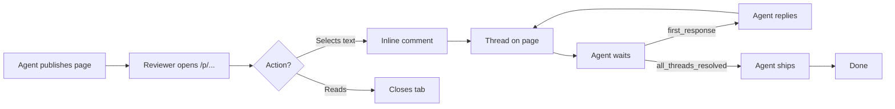

A small vocabulary covers most of the product surface.

## Workspaces

A workspace is the tenant boundary. Every page, folder, comment, attachment, publication, and audit log carries a workspace ID. Users belong to one or more workspaces. Self-hosted instances start with one workspace; managed signup creates one per account.

## Pages and folders

Everything visible in the content tree is a page. Folders are organizational containers. Pages can be regular docs, specs, runbooks, `SKILL.md` files, HTML pages, or other structured documents. Source format is Markdown, GFM, MDX, or raw HTML.

## Templates

Templates are workspace-level scaffolds for predictable agent output. They can include typed properties, visible starter text, and hidden guidance comments. Pages created from templates are normal pages with comments, versions, attachments, sharing, search, and Backup to Git.

## Rendered and source modes

Each page opens in polished rendered mode. When you click Edit, the same document unlocks into a CodeMirror 6 editor with Obsidian-style Markdown preview: formatting marks stay quiet until the active line or range needs source-level editing.

## Comments and threads

Selecting rendered text opens an inline comment. Comments group into threads in the right sidebar. Threads can be replied to, resolved, and unresolved. Agent replies carry agent name, model, session ID, and timestamp.

## Publishing

Pages publish at `/p/page-title-id`. Folders publish at `/f/folder-title-id` and expose only that folder subtree. Published resources can be View, Comment, or Edit, with optional expiry, password, and search indexing.

## Backup to Git

Workspace admins can connect a GitHub repository. Sync writes pages, templates, optional assets, and `.vegastack-pages/manifest.json` under a configured root path. The app remains the primary database; Git is a portable backup and audit trail.

## Wait conditions

Agents call `wait_for_review` with one of: `first_response`, `new_comment`, `all_threads_resolved`, or `timeout`. The agent pauses until the condition matches, then resumes with the relevant context.

## The review loop

The end-to-end shape of one review cycle:

## Storage shape

A simple diagram, drawn with inline SVG so it stays crisp at any zoom:

<svg viewBox="0 0 480 140" role="img" aria-label="Storage diagram showing R2 holding source and attachments, D1 holding metadata and comments" xmlns="http://www.w3.org/2000/svg">
  <rect x="10" y="20" width="140" height="100" rx="8" fill="none" stroke="currentColor" stroke-width="1.2" />
  <text x="80" y="50" text-anchor="middle" font-family="var(--font-sans)" font-size="14" font-weight="600" fill="currentColor">R2 / S3</text>
  <text x="80" y="74" text-anchor="middle" font-family="var(--font-sans)" font-size="11" fill="currentColor" opacity="0.65">Source</text>
  <text x="80" y="90" text-anchor="middle" font-family="var(--font-sans)" font-size="11" fill="currentColor" opacity="0.65">Attachments</text>
  <text x="80" y="106" text-anchor="middle" font-family="var(--font-sans)" font-size="11" fill="currentColor" opacity="0.65">Render cache</text>
  <line x1="160" y1="70" x2="320" y2="70" stroke="currentColor" stroke-width="1" stroke-dasharray="3 3" opacity="0.5" />
  <rect x="330" y="20" width="140" height="100" rx="8" fill="none" stroke="currentColor" stroke-width="1.2" />
  <text x="400" y="50" text-anchor="middle" font-family="var(--font-sans)" font-size="14" font-weight="600" fill="currentColor">D1 / SQLite</text>
  <text x="400" y="74" text-anchor="middle" font-family="var(--font-sans)" font-size="11" fill="currentColor" opacity="0.65">Metadata</text>
  <text x="400" y="90" text-anchor="middle" font-family="var(--font-sans)" font-size="11" fill="currentColor" opacity="0.65">Comments</text>
  <text x="400" y="106" text-anchor="middle" font-family="var(--font-sans)" font-size="11" fill="currentColor" opacity="0.65">Permissions</text>
</svg>
