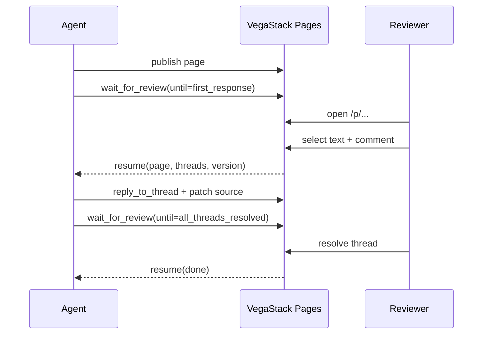

`wait_for_review` is the call that turns publish-and-continue into publish-and-pause. The agent yields, the server holds the session, and the response carries the context the agent needs to resume.

## The four conditions

| Condition              | Resumes when                                                   |
| ---------------------- | -------------------------------------------------------------- |
| `first_response`       | The first new comment, thread, or thread state change arrives. |
| `new_comment`          | Any new comment is created.                                    |
| `all_threads_resolved` | Every open thread on the page is marked resolved.              |
| `timeout`              | The configured timeout elapses with no qualifying event.       |

You can pass a single condition or compose more than one. The first to match wins.

## Example

```ts
const review = await mcp.call("wait_for_review", {
  workspace_id: "wks_123",
  page_id: "pg_abc123",
  until: "all_threads_resolved",
  timeout_ms: 600000,
});
```

The timeout is expressed in milliseconds and is capped at 10 minutes for a single call. The response includes the thread list and recent review events. The agent can then patch source, reply to threads, or call `wait_for_review` again.

## Idle behaviour

While waiting, the agent can yield control. The response includes current thread state and recent review events so the next step can patch, reply, resolve, or wait again.

## Resume flow


